# Fluxos e Processos - IN Conjunta ITERPA / IDEFLOR-Bio

> Derivado da IN Conjunta ITERPA/IDEFLOR-Bio - Certificação Fundiária e Incorporação de Imóveis em UCES
>
> **Dica:** No GitHub, use o botão de tela cheia (fullscreen) dos diagramas Mermaid para visualização completa. Os diagramas foram desenhados de cima para baixo para evitar sobreposição com os controles de navegação.

## 1. Visão Geral do Processo

O fluxo principal e **estritamente sequencial** em 3 fases:

```mermaid
flowchart LR
    classDef iterpa fill:#D6EAF8,stroke:#2980B9,stroke-width:3px,color:#1B4F72
    classDef ideflor fill:#D5F5E3,stroke:#27AE60,stroke-width:3px,color:#1E8449
    classDef fase3 fill:#FDEBD0,stroke:#E67E22,stroke-width:3px,color:#935116
    classDef cert fill:#E8DAEF,stroke:#8E44AD,stroke-width:3px,color:#6C3483

    F1["<b>FASE I</b><br/>ITERPA<br/>Análise Fundiária"]:::iterpa
    --> |Certidão CACLG| C1(("📜 CACLG")):::cert
    --> F2["<b>FASE II</b><br/>IDEFLOR-Bio<br/>Análise e Habilitação"]:::ideflor
    --> |Certidão de Habilitação| C2(("📜 CH")):::cert
    --> F3["<b>FASE III</b><br/>ITERPA + IDEFLOR-Bio<br/>Transferência de Domínio"]:::fase3
    --> |Certidão de Conclusão| C3(("📜 CCI")):::cert

    style C1 stroke-width:4px
    style C2 stroke-width:4px
    style C3 stroke-width:4px
```

**Regra fundamental (Art. 2º, §único):** O processo somente avança à fase seguinte após a conclusão integral da fase anterior e a emissão do respectivo instrumento certificatório.

### Detalhamento das Certidões

| Certidão | Sigla | Emitida por | Habilita |
|----------|-------|-------------|----------|
| Certidão de Autenticidade, Correspondência de Localização e Localização Georreferenciada | CACLG | ITERPA | Fase II |
| Certidão de Habilitação | CH | IDEFLOR-Bio | Fase III |
| Certidão de Conclusão de Incorporação | CCI | IDEFLOR-Bio | Conclusão do processo |

---

## 2. Fluxo Detalhado - Fase I: Análise Fundiária pelo ITERPA

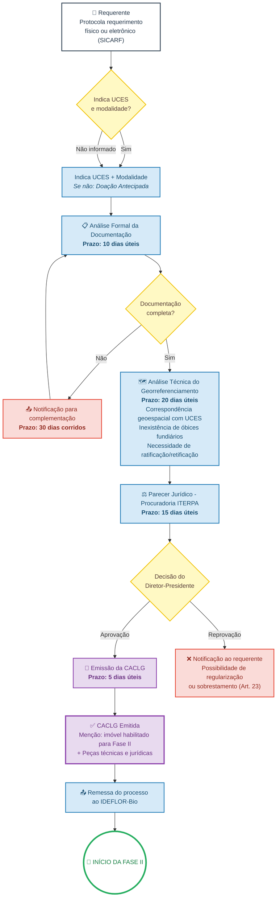

### Documentação Mínima - Fase I (Art. 8º)

1. Documentação exigida pela IN ITERPA 001/2022 para CACLG
2. Indicação da UCES de interesse
3. Indicação da modalidade de incorporação pretendida
4. Extrato atualizado do CAR no SICAR (situação ativa e regular)
5. Relatório de sobreposição com áreas protegidas, TI, TQ e imóveis públicos

---

## 3. Fluxo Detalhado - Fase II: Análise e Habilitação pelo IDEFLOR-Bio

### 3.1 Fluxo Geral - Distribuição Sequencial

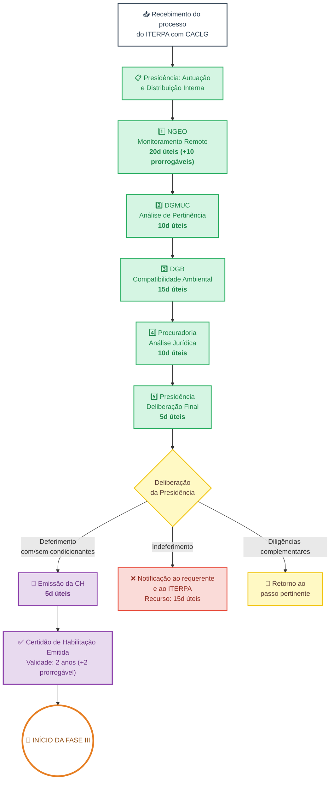

> **Regra (Art. 11, §único):** O processo segue obrigatoriamente a ordem NGEO → DGMUC → DGB → Procuradoria → Presidência, sem pular etapas.

### 3.2 Detalhamento - NGEO (Monitoramento Remoto)

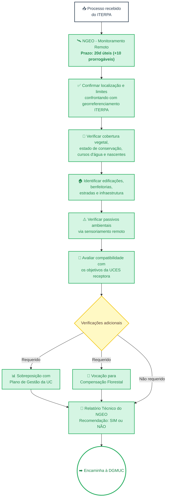

### 3.3 Detalhamento - DGMUC (Análise de Pertinência)

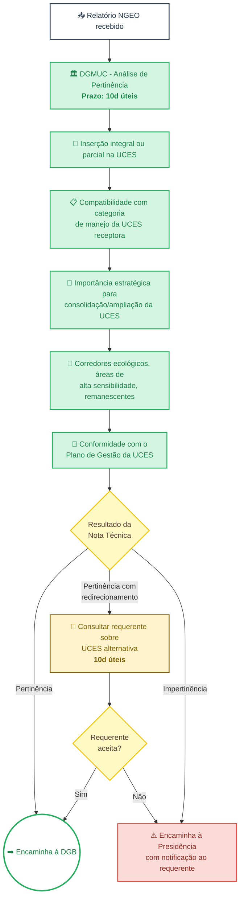

### 3.4 Detalhamento - DGB + Procuradoria + Presidência

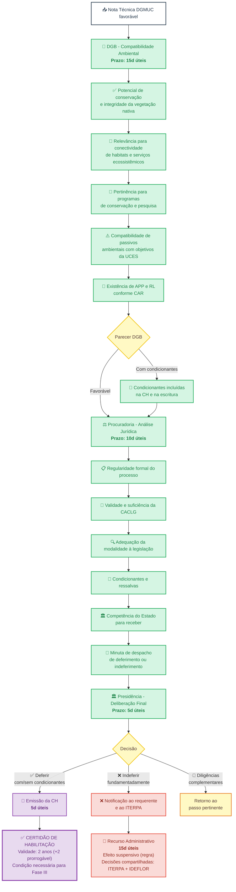

### Conteúdo Obrigatório da CH (Art. 16)

| Campo | Descrição |
|-------|-----------|
| I | Identificação completa do imóvel (matrícula, município, coordenadas, área em ha) |
| II | Referência à CACLG (número e data) |
| III | Identificação do Doador ou Doador Beneficiário |
| IV | UCES receptora, categoria de manejo e zona de inserção |
| V | Área habilitada em hectares (quando diferente da área total) |
| VI | Modalidade de incorporação |
| VII | Condicionantes técnicas ou ambientais para Fase III |
| VIII | Prazo de validade: 2 anos (prorrogáveis por +2 anos) |
| IX | Declaração de que a CH é condição necessária para Fase III |

---

## 4. Fluxo Detalhado - Fase III: Transferência do Domínio

```mermaid
flowchart TD
    classDef fase3 fill:#FDEBD0,stroke:#E67E22,stroke-width:2px,color:#935116
    classDef documento fill:#E8DAEF,stroke:#8E44AD,stroke-width:2px,color:#6C3483
    classDef inicio fill:#FFFFFF,stroke:#2C3E50,stroke-width:2px,color:#2C3E50
    classDef iterpa fill:#D6EAF8,stroke:#2980B9,stroke-width:2px,color:#1B4F72
    classDef ideflor fill:#D5F5E3,stroke:#27AE60,stroke-width:2px,color:#1E8449

    CHOK["✅ CH Emitida"]:::inicio
    --> REQ["🧑 Requerimento do Doador<br/>ao IDEFLOR-Bio solicitando<br/>lavratura da escritura"]:::ideflor

    REQ --> ENC["📤 IDEFLOR-Bio encaminha<br/>ao ITERPA"]:::ideflor

    ENC --> VERIF["📋 ITERPA: Verificação de Documentos<br/>Solicitar atualização dos vencidos"]:::iterpa

    VERIF --> MINUTA["📄 ITERPA: Elaboração de Minuta de Escritura<br/><b>Prazo: 15d úteis</b><br/>Cláusulas obrigatórias (Art. 20)"]:::iterpa

    MINUTA --> CLAUSULAS["📝 Cláusulas da Escritura"]:::fase3

    CLAUSULAS --> C1["I - Qualificação das partes"]:::fase3
    C1 --> C2["II - Descrição do imóvel conforme geo"]:::fase3
    C2 --> C3["III - Livre e desembaraçado"]:::fase3
    C3 --> C4["IV - Aceite do Estado do Pará (ITERPA)"]:::fase3
    C4 --> C5["V - Destinação à UCES sob gestão IDEFLOR-Bio"]:::fase3
    C5 --> C6["VI - Modalidade + créditos de compensação"]:::fase3
    C6 --> C7["VII - Condicionantes da CH"]:::fase3
    C7 --> C8["VIII - Ocupações tradicionais (Termo de Acordo)"]:::fase3

    C8 --> LAV["📝 Lavratura da Escritura<br/>Cartório de Notas competente<br/><b>Despesas: Doador (regra geral)</b>"]:::fase3

    LAV --> REG["📋 Registro no Cartório de Imóveis<br/><b>Prazo: 30 dias corridos</b>"]:::fase3

    REG --> COM["📤 ITERPA comunica IDEFLOR-Bio<br/>Inc. ao patrimônio do Estado<br/>+ Atualização do CNUC"]:::iterpa

    COM --> CCI["📜 Certidão de Conclusão de Incorporação<br/><b>Prazo: 10d úteis</b><br/>Matrícula + Área + UCES + Modalidade + Créditos"]:::documento

    CCI --> FIM(("✅ PROCESSO CONCLUÍDO")):::inicio

    style FIM stroke:#27AE60,stroke-width:4px,color:#1E8449
    style CCI stroke-width:3px
    style CHOK stroke:#8E44AD,stroke-width:3px
```

---

## 5. Fluxo de Recursos Administrativos

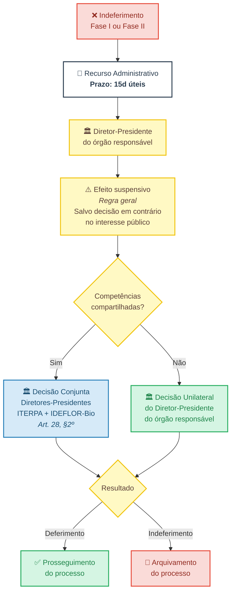

---

## 6. Fluxo de Gestão de Créditos de Compensação

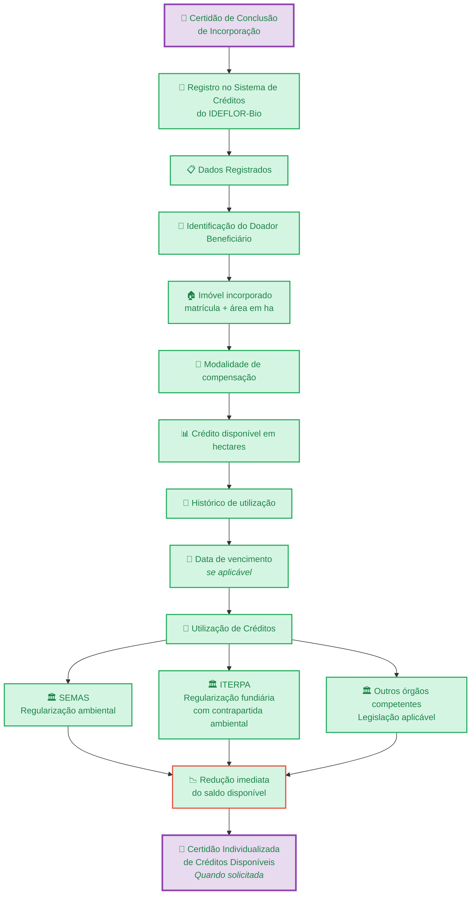

---

## 7. Impedimentos à Incorporação (Art. 6º)

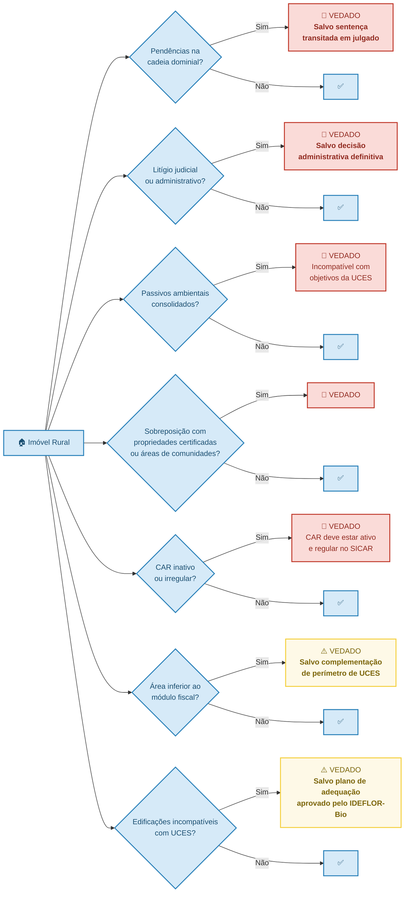

> **Nota sobre ocupações tradicionais (Art. 6º, §2º):** A existência de ocupações tradicionais no imóvel **não constitui impedimento**, desde que compatíveis com os objetivos da UCES e sujeitas a Termo de Acordo entre IDEFLOR-Bio e os ocupantes.

---

## 8. Quadro Resumo de Prazos

### Fase I - ITERPA

| Etapa | Prazo | Referência |
|-------|-------|------------|
| Análise formal da documentação | 10 dias úteis | Art. 38, I |
| Complementação de documentos (requerente) | 30 dias corridos | Art. 38, II |
| Análise técnica do georreferenciamento | 20 dias úteis | Art. 38, III |
| Parecer jurídico ITERPA | 15 dias úteis | Art. 38, IV |
| Emissão da CACLG | 5 dias úteis | Art. 38, V |

### Fase II - IDEFLOR-Bio

| Etapa | Prazo | Referência |
|-------|-------|------------|
| Análise de pertinência (DGMUC) | 10 dias úteis | Art. 39, I |
| Checagem/monitoramento remoto (NGEO) | 20 dias úteis (+10) | Art. 39, II |
| Análise compatibilidade ambiental (DGB) | 15 dias úteis | Art. 39, III |
| Parecer jurídico (Procuradoria) | 10 dias úteis | Art. 39, IV |
| Deliberação da Presidência | 5 dias úteis | Art. 39, V |
| Emissão da CH | 5 dias úteis | Art. 39, VI |
| Consulta sobre redirecionamento (requerente) | 10 dias úteis | Art. 13, §3º |
| Recurso administrativo | 15 dias úteis | Art. 28 |

### Fase III - Transferência

| Etapa | Prazo | Referência |
|-------|-------|------------|
| Elaboração de minuta de escritura (ITERPA) | 15 dias úteis | Art. 40, I |
| Registro da escritura (ITERPA) | 30 dias corridos | Art. 40, II |
| Emissão Certidão de Conclusão (IDEFLOR-Bio) | 10 dias úteis | Art. 40, III |
| Validade da CH | 2 anos (+2 anos prorrogável) | Art. 16, VIII |

### Linha do Tempo Visual

```mermaid
gantt
    title Prazos por Fase (estimativa melhor cenário)
    dateFormat  X
    axisFormat  %s

    section Fase I - ITERPA
    Análise Formal              :0, 10
    Georreferenciamento         :10, 30
    Parecer Jurídico            :30, 45
    Emissão CACLG               :45, 50

    section Fase II - IDEFLOR-Bio
    DGMUC - Pertinência         :50, 60
    NGEO - Monitoramento        :60, 80
    DGB - Compatibilidade       :80, 95
    Procuradoria                :95, 105
    Presidência                 :105, 110
    Emissão CH                  :110, 115

    section Fase III - Transferência
    Minuta de Escritura         :115, 130
    Registro Escritura (30d)    :130, 160
    Certidão de Conclusão       :160, 170
```

> **Total estimado:** ~50 dias úteis (Fase I) + ~65 dias úteis (Fase II) + ~55 dias corridos (Fase III) = **aproximadamente 14-16 semanas** no melhor cenário, sem pendências ou prorrogações.