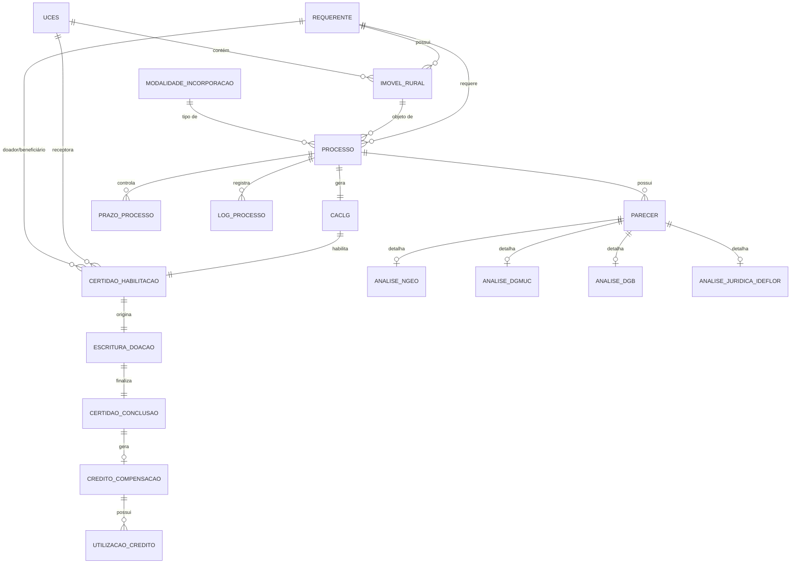
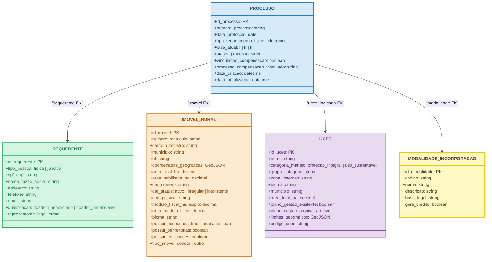
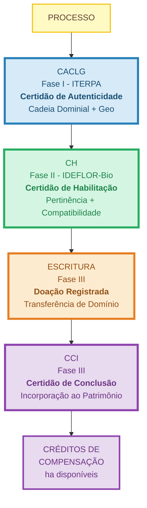

# Modelo de Dados Conceitual - IN Conjunta ITERPA / IDEFLOR-Bio

> Derivado da IN Conjunta ITERPA/IDEFLOR-Bio - Certificação Fundiária e Incorporação de Imóveis em UCES
>
> **Dica:** No GitHub, use o botão de tela cheia (fullscreen) dos diagramas Mermaid para visualização completa.

## 1. Visão Geral - Diagrama de Entidades e Relacionamentos



---

## 2. Entidades Principais



---

## 3. Entidades de Certificação e Documentos

```mermaid
classDiagram
    class CACLG {
        +id_caclg: PK
        +numero_caclg: string
        +data_emissao: date
        +data_validade: date
        +status: em_analise | emitida | vencida | cancelada
        +cadeia_dominial_regular: boolean
        +georreferenciamento_valido: boolean
        +correspondencia_localizacao: boolean
        +habilitado_fase_ii: boolean
        +observacoes_iterpa: text
        +documento_caclg: arquivo
        +pecas_tecnicas_juridicas: arquivo[]
    }

    class CERTIDAO_HABILITACAO {
        +id_ch: PK
        +numero_ch: string
        +data_emissao: date
        +data_validade: date
        +data_prorrogacao: date
        +status: em_analise | emitida | vencida | prorrogada | cancelada
        +imovel_identificacao: string
        +categoria_manejo: string
        +zona_insercao: string
        +area_habilitada_ha: decimal
        +condicionantes_tecnicas_ambientais: text
        +condicao_necessaria_fase_iii: boolean
        +documento_ch: arquivo
    }

    class ESCRITURA_DOACAO {
        +id_escritura: PK
        +numero_escritura: string
        +data_lavratura: date
        +cartorio_notas: string
        +qualificacao_partes: text
        +descricao_imovel_geo: text
        +declaracao_livre_desembaracado: text
        +aceite_estado_para: boolean
        +clausula_destinacao_uces: text
        +modalidade_doacao: string
        +creditos_compensacao_gerados: decimal
        +condicionantes_ch: text
        +clausula_ocupacoes_tradicionais: text
        +despesas_responsavel: doador | estado
        +data_registro: date
        +cartorio_registro_imoveis: string
        +status: minuta | lavrada | registrada
        +arquivo_escritura: arquivo
    }

    class CERTIDAO_CONCLUSAO {
        +id_certidao_conclusao: PK
        +numero_certidao: string
        +data_emissao: date
        +numero_matricula_nova_propriedade: string
        +area_incorporada_ha: decimal
        +creditos_compensacao_gerados_ha: decimal
        +data_registro: date
        +documento_certidao: arquivo
    }

    PROCESSO --> CACLG : "1:1"
    PROCESSO --> CERTIDAO_HABILITACAO : "1:1"
    PROCESSO --> ESCRITURA_DOACAO : "1:1"
    PROCESSO --> CERTIDAO_CONCLUSAO : "1:1"
    CACLG --> CERTIDAO_HABILITACAO : "origina"
    CERTIDAO_HABILITACAO --> ESCRITURA_DOACAO : "origina"
    ESCRITURA_DOACAO --> CERTIDAO_CONCLUSAO : "finaliza"
    CERTIDAO_HABILITACAO --> UCES : "uces_receptora FK"
    CERTIDAO_HABILITACAO --> REQUERENTE : "doador_beneficiario FK"
    CERTIDAO_HABILITACAO --> MODALIDADE_INCORPORACAO : "modalidade FK"
    CERTIDAO_CONCLUSAO --> UCES : "uces_receptora FK"
    CERTIDAO_CONCLUSAO --> MODALIDADE_INCORPORACAO : "modalidade FK"

    style CACLG fill:#D6EAF8,stroke:#2980B9,stroke-width:3px,color:#1B4F72
    style CERTIDAO_HABILITACAO fill:#D5F5E3,stroke:#27AE60,stroke-width:3px,color:#1E8449
    style ESCRITURA_DOACAO fill:#FDEBD0,stroke:#E67E22,stroke-width:3px,color:#935116
    style CERTIDAO_CONCLUSAO fill:#E8DAEF,stroke:#8E44AD,stroke-width:3px,color:#6C3483
```

---

## 4. Entidades de Análise e Pareceres

```mermaid
classDiagram
    class PARECER {
        +id_parecer: PK
        +unidade_emitente: ITERPA | NGEO | DGMUC | DGB | PROCURADORIA_IDEFLOR | PROCURADORIA_ITERPA | PRESIDENCIA
        +tipo_parecer: tecnico | juridico | nota_tecnica | despacho
        +data_inicio: date
        +data_conclusao: date
        +prazo_dias_uteis: int
        +resultado: favoravel | favoravel_com_ressalvas | desfavoravel | diligencia
        +conteudo: text
        +condicionantes: text
        +responsavel: string
        +arquivo_parecer: arquivo
    }

    class ANALISE_NGEO {
        +id_analise_ngeo: PK
        +localizacao_confirmada: boolean
        +limites_confrontados_geo: boolean
        +cobertura_vegetal: text
        +estado_conservacao: text
        +cursos_agua_nascentes: text
        +edificacoes_infracoes_identificadas: text
        +passivos_ambientais_remoto: boolean
        +compatibilidade_uces: boolean
        +sobreposicao_plano_gestao: boolean
        +vocacao_compensacao_florestal: boolean
        +recomendacao_recebimento: boolean
        +necessidade_visitoria_campo: boolean
        +relatorio_tecnico: arquivo
    }

    class ANALISE_DGMUC {
        +id_analise_dgmuc: PK
        +imovel_inserido_integralmente: boolean
        +imovel_inserido_parcialmente: boolean
        +compatibilidade_categoria_manejo: boolean
        +importancia_estrategica: text
        +corredores_ecologicos: boolean
        +areas_sensibilidade: boolean
        +remanescentes_florestais: boolean
        +conformidade_plano_gestao: boolean
        +resultado: pertinencia | pertinencia_redirecionamento | impertinencia
        +nota_tecnica: arquivo
    }

    class ANALISE_DGB {
        +id_analise_dgb: PK
        +potencial_conservacao: text
        +integridade_ecossistemas: text
        +pertinencia_programas_conservacao: boolean
        +passivos_ambientais_recuperaveis: boolean
        +medidas_recuperacao_necessarias: text
        +areas_app: boolean
        +areas_rl: boolean
        +compatibilidade_ambiental: boolean
        +condicionantes_incorporacao: text
        +parecer_tecnico: arquivo
    }

    class ANALISE_JURIDICA_IDEFLOR {
        +id_analise_juridica: PK
        +regularidade_formal: boolean
        +validade_caclg: boolean
        +suficiencia_caclg: boolean
        +adequacao_modalidade: boolean
        +condicionantes_legais: text
        +competencia_estado: boolean
        +tipo_despacho: deferimento | indeferimento
        +irregularidades_sanaveis: text
        +minuta_despacho: arquivo
    }

    PROCESSO --> PARECER : "1:N"
    PARECER --> ANALISE_NGEO : "1:0..1"
    PARECER --> ANALISE_DGMUC : "1:0..1"
    PARECER --> ANALISE_DGB : "1:0..1"
    PARECER --> ANALISE_JURIDICA_IDEFLOR : "1:0..1"
    ANALISE_DGMUC --> UCES : "uces_alternativa_sugerida FK"

    style PARECER fill:#FFF9C4,stroke:#F1C40F,stroke-width:3px,color:#5D4037
    style ANALISE_NGEO fill:#D5F5E3,stroke:#27AE60,stroke-width:2px,color:#1E8449
    style ANALISE_DGMUC fill:#D5F5E3,stroke:#27AE60,stroke-width:2px,color:#1E8449
    style ANALISE_DGB fill:#D5F5E3,stroke:#27AE60,stroke-width:2px,color:#1E8449
    style ANALISE_JURIDICA_IDEFLOR fill:#D5F5E3,stroke:#27AE60,stroke-width:2px,color:#1E8449
```

---

## 5. Entidades de Créditos de Compensação

```mermaid
classDiagram
    class CREDITO_COMPENSACAO {
        +id_credito: PK
        +credito_disponivel_ha: decimal
        +credito_utilizado_ha: decimal
        +saldo_disponivel_ha: decimal
        +data_vencimento: date
        +status: ativo | utilizado | vencido | cancelado
    }

    class UTILIZACAO_CREDITO {
        +id_utilizacao: PK
        +data_utilizacao: date
        +orgao_destino: SEMAS | ITERPA | outro
        +processo_vinculado: string
        +hectares_utilizados: decimal
        +descricao: text
        +certidao_individualizada: arquivo
    }

    PROCESSO --> CREDITO_COMPENSACAO : "1:0..1"
    CREDITO_COMPENSACAO --> REQUERENTE : "doador_beneficiario FK"
    CREDITO_COMPENSACAO --> IMOVEL_RURAL : "imovel FK"
    CREDITO_COMPENSACAO --> CERTIDAO_CONCLUSAO : "certidao_conclusao FK"
    CREDITO_COMPENSACAO --> MODALIDADE_INCORPORACAO : "modalidade FK"
    CREDITO_COMPENSACAO --> UTILIZACAO_CREDITO : "1:N"

    style CREDITO_COMPENSACAO fill:#E8DAEF,stroke:#8E44AD,stroke-width:3px,color:#6C3483
    style UTILIZACAO_CREDITO fill:#D7BDE2,stroke:#8E44AD,stroke-width:2px,color:#6C3483
```

---

## 6. Entidades de Prazos e Controle

```mermaid
classDiagram
    class PRAZO_PROCESSO {
        +id_prazo: PK
        +fase: I | II | III
        +etapa: string
        +data_inicio: datetime
        +prazo_dias: int
        +tipo_prazo: uteis | corridos
        +data_limite: datetime
        +data_conclusao: datetime
        +prorrogado: boolean
        +dias_prorrogacao: int
        +status: pendente | em_andamento | concluido | vencido
        +responsavel: string
    }

    class LOG_PROCESSO {
        +id_log: PK
        +data_hora: datetime
        +acao: string
        +unidade_responsavel: string
        +usuario_responsavel: string
        +observacoes: text
        +documento_vinculado: arquivo
    }

    PROCESSO --> PRAZO_PROCESSO : "1:N"
    PROCESSO --> LOG_PROCESSO : "1:N"

    style PRAZO_PROCESSO fill:#D6EAF8,stroke:#2980B9,stroke-width:2px,color:#1B4F72
    style LOG_PROCESSO fill:#D6EAF8,stroke:#2980B9,stroke-width:2px,color:#1B4F72
```

---

## 7. Diagrama do Fluxo de Certidões



---

## 8. Enums / Domínios

```
MODALIDADE_INCORPORACAO = [
  "doacao_voluntaria",
  "doacao_antecipada",
  "compensacao_reserva_legal",
  "compensacao_florestal",
  "medidas_compensatorias_ambientais"
]

FASE_PROCESSO = ["I", "II", "III"]

STATUS_PROCESSO = [
  "requerido",
  "em_analise_formal",
  "em_analise_georreferenciamento",
  "em_parecer_juridico_iterpa",
  "caclg_emitida",
  "em_analise_ngeo",
  "em_analise_dgmuc",
  "em_analise_dgb",
  "em_analise_juridica_ideflor",
  "em_deliberacao_presidencia",
  "ch_emitida",
  "em_elaboracao_minuta",
  "escritura_lavrada",
  "escritura_registrada",
  "concluido",
  "indeferido",
  "arquivado"
]

TIPO_PARECER = ["tecnico", "juridico", "nota_tecnica", "despacho"]

RESULTADO_PARECER = ["favoravel", "favoravel_com_ressalvas", "desfavoravel", "diligencia"]

RESULTADO_DGMUC = ["pertinencia", "pertinencia_redirecionamento", "impertinencia"]

STATUS_CACLG = ["em_analise", "emitida", "vencida", "cancelada"]

STATUS_CH = ["em_analise", "emitida", "vencida", "prorrogada", "cancelada"]

STATUS_ESCRITURA = ["minuta", "lavrada", "registrada"]

CAR_STATUS = ["ativo", "irregular", "inexistente"]

TIPO_PESSOA = ["fisica", "juridica"]

QUALIFICACAO_DOADOR = ["doador", "beneficiario", "doador_beneficiario"]
```

### Diagrama de Estados do Processo

```mermaid
stateDiagram-v2
    classDef iterpa fill:#D6EAF8,stroke:#2980B9,color:#1B4F72
    classDef ideflor fill:#D5F5E3,stroke:#27AE60,color:#1E8449
    classDef fase3 fill:#FDEBD0,stroke:#E67E22,color:#935116
    classDef final fill:#E8DAEF,stroke:#8E44AD,color:#6C3483

    [*] --> requerido

    state "FASE I - ITERPA" as faseI {
        requerido --> em_analise_formal
        em_analise_formal --> em_analise_georreferenciamento : Documentação OK
        em_analise_georreferenciamento --> em_parecer_juridico_iterpa
        em_parecer_juridico_iterpa --> caclg_emitida : Aprovação
    }

    state "FASE II - IDEFLOR-Bio" as faseII {
        caclg_emitida --> em_analise_ngeo
        em_analise_ngeo --> em_analise_dgmuc
        em_analise_dgmuc --> em_analise_dgb : Pertinência
        em_analise_dgb --> em_analise_juridica_ideflor
        em_analise_juridica_ideflor --> em_deliberacao_presidencia
        em_deliberacao_presidencia --> ch_emitida : Deferimento
    }

    state "FASE III - Transferência" as faseIII {
        ch_emitida --> em_elaboracao_minuta
        em_elaboracao_minuta --> escritura_lavrada
        escritura_lavrada --> escritura_registrada
        escritura_registrada --> concluido
    }

    em_parecer_juridico_iterpa --> indeferido : Reprovação
    em_deliberacao_presidencia --> indeferido : Indeferimento
    em_deliberacao_presidencia --> requerido : Diligências

    concluido --> [*]
    indeferido --> [*]