# Modelo de Dados Conceitual - IN Conjunta ITERPA / IDEFLOR-Bio

> Derivado da IN Conjunta ITERPA/IDEFLOR-Bio - Certificação Fundiária e Incorporação de Imóveis em UCES
>
> **Dica:** No GitHub, use o botão de tela cheia (fullscreen) dos diagramas Mermaid para visualização completa.

## 1. Visão Geral - Relacionamentos

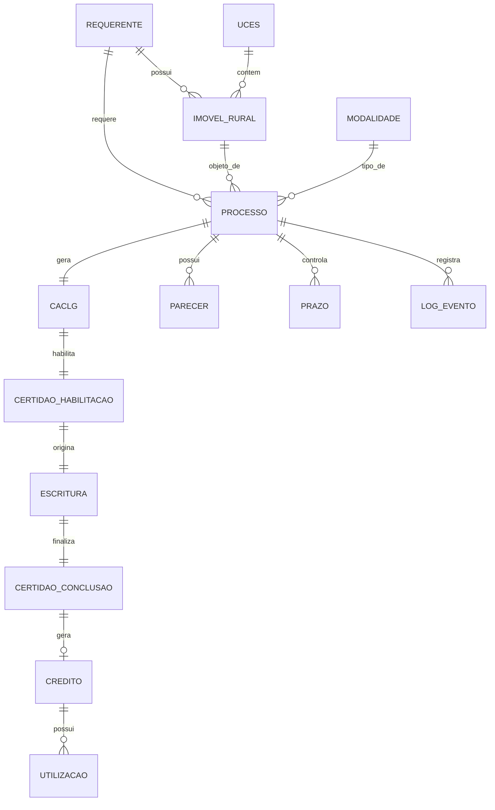

---

## 2. Entidades Principais - Processo e Atores

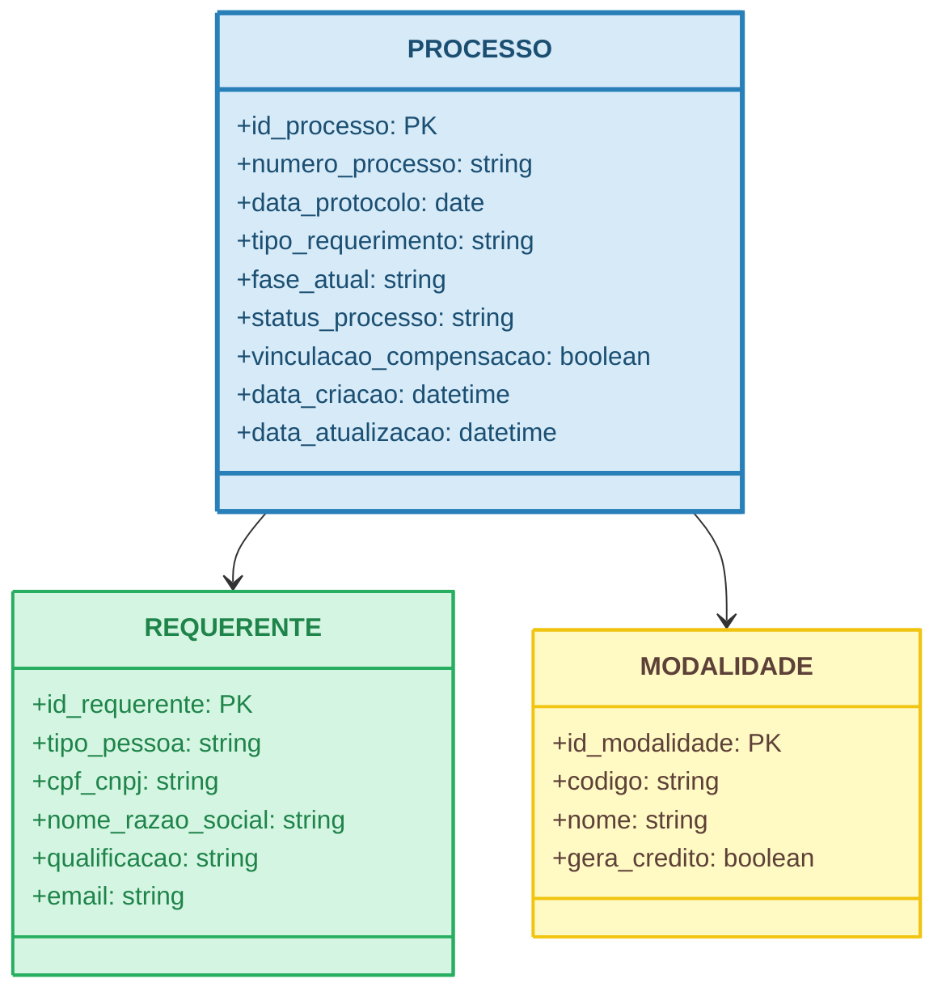

---

## 3. Entidades Principais - Imóvel e UCES

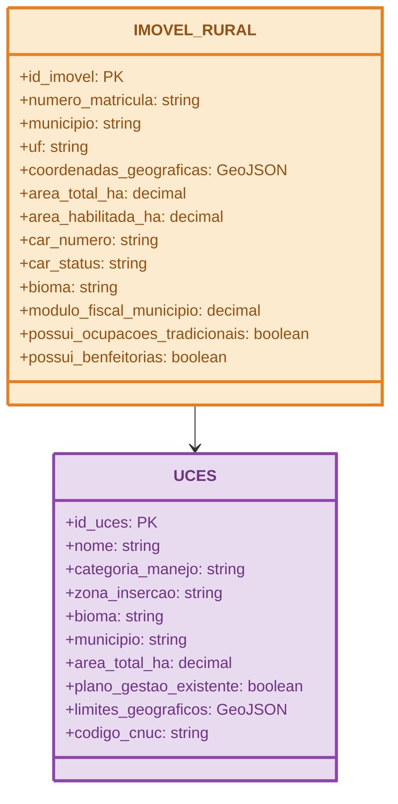

---

## 4. Entidades de Certificação - CACLG (Fase I)

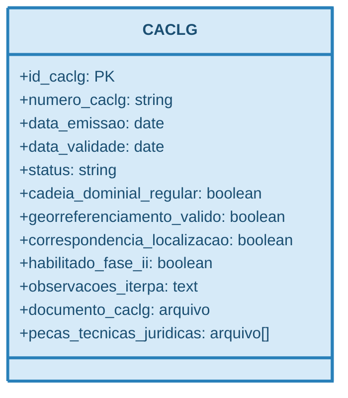

---

## 5. Entidades de Certificação - CH (Fase II)

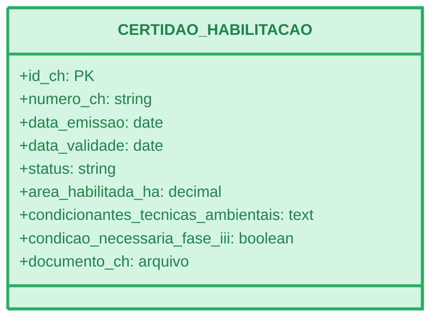

---

## 6. Entidades de Certificação - Escritura e Conclusão (Fase III)

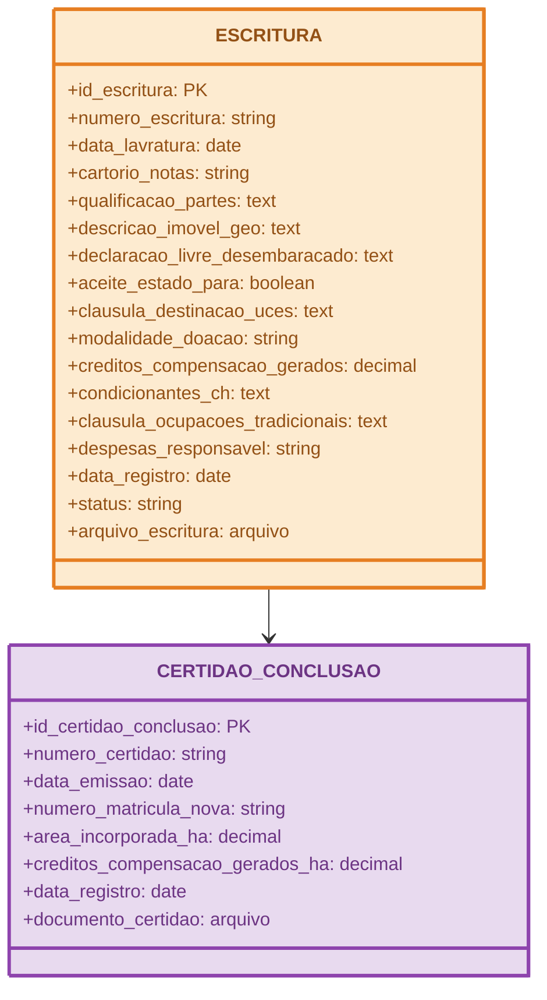

---

## 7. Entidades de Análise - Parecer

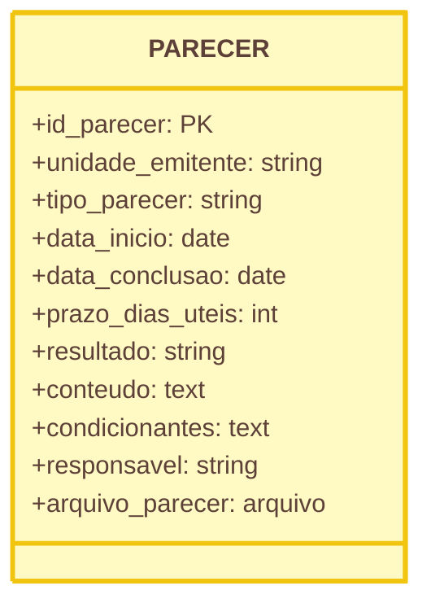

---

## 8. Entidades de Análise - NGEO

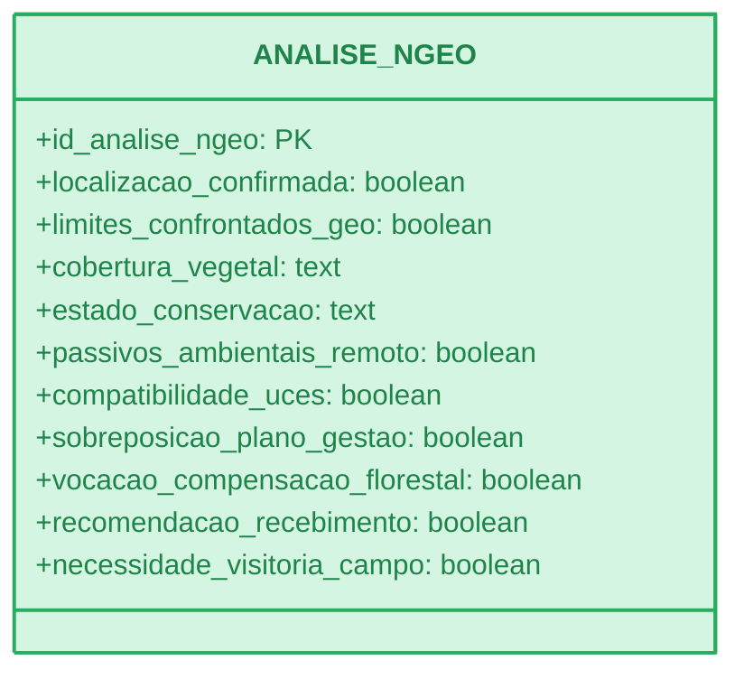

---

## 9. Entidades de Análise - DGMUC e DGB

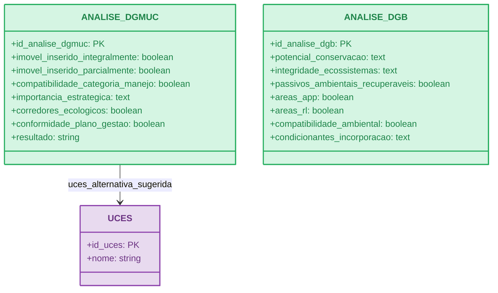

---

## 10. Entidades de Análise - Procuradoria

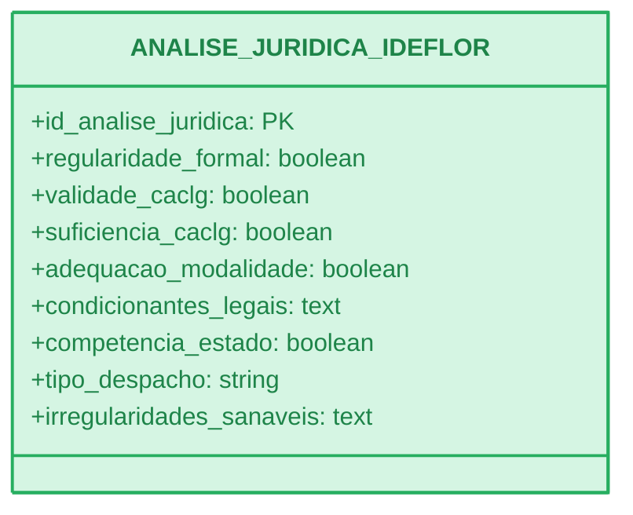

---

## 11. Entidades de Créditos de Compensação

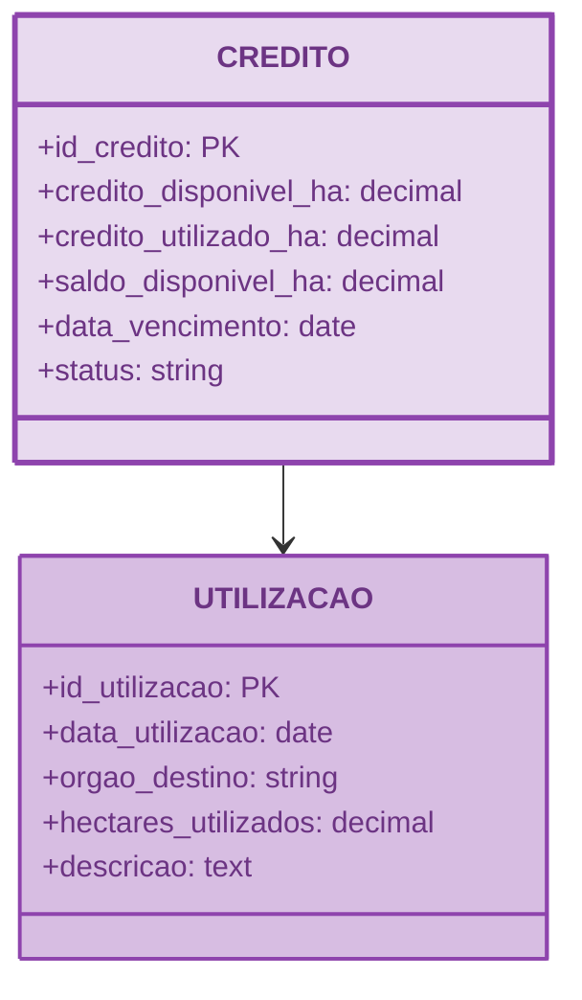

---

## 12. Entidades de Controle - Prazos e Logs

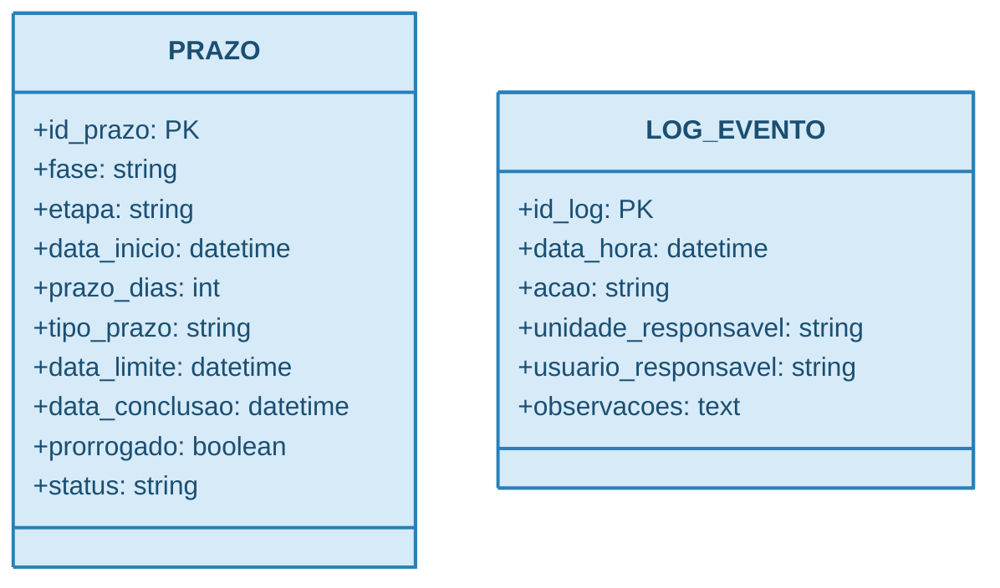

---

## 13. Diagrama do Fluxo de Certidões

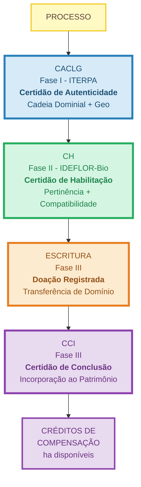

---

## 14. Diagrama de Estados do Processo

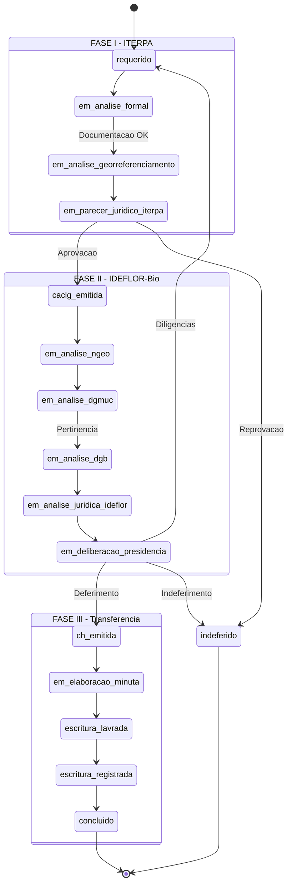

---

## 15. Enums / Domínios

### MODALIDADE_INCORPORACAO

| Valor | Descrição |
|-------|-----------|
| `doacao_voluntaria` | Doação voluntária |
| `doacao_antecipada` | Doação antecipada |
| `compensacao_reserva_legal` | Compensação de Reserva Legal |
| `compensacao_florestal` | Compensação florestal |
| `medidas_compensatorias_ambientais` | Cumprimento de medidas compensatórias ambientais |

### FASE_PROCESSO

| Valor | Descrição |
|-------|-----------|
| `I` | Fase I - Análise Fundiária (ITERPA) |
| `II` | Fase II - Análise e Habilitação (IDEFLOR-Bio) |
| `III` | Fase III - Transferência de Domínio |

### STATUS_PROCESSO

| Valor | Fase | Descrição |
|-------|------|-----------|
| `requerido` | I | Processo protocolado |
| `em_analise_formal` | I | Análise formal da documentação |
| `em_analise_georreferenciamento` | I | Análise técnica do georreferenciamento |
| `em_parecer_juridico_iterpa` | I | Parecer jurídico ITERPA |
| `caclg_emitida` | I→II | CACLG emitida, aguardando remessa |
| `em_analise_ngeo` | II | Análise no NGEO |
| `em_analise_dgmuc` | II | Análise de pertinência na DGMUC |
| `em_analise_dgb` | II | Análise de compatibilidade na DGB |
| `em_analise_juridica_ideflor` | II | Parecer jurídico IDEFLOR-Bio |
| `em_deliberacao_presidencia` | II | Deliberação da Presidência |
| `ch_emitida` | II→III | CH emitida |
| `em_elaboracao_minuta` | III | Elaboração de minuta de escritura |
| `escritura_lavrada` | III | Escritura lavrada |
| `escritura_registrada` | III | Escritura registrada |
| `concluido` | III | Processo concluído |
| `indeferido` | - | Processo indeferido |
| `arquivado` | - | Processo arquivado |

### TIPO_PARECER

| Valor | Descrição |
|-------|-----------|
| `tecnico` | Parecer técnico |
| `juridico` | Parecer jurídico |
| `nota_tecnica` | Nota técnica |
| `despacho` | Despacho |

### RESULTADO_PARECER

| Valor | Descrição |
|-------|-----------|
| `favoravel` | Favorável |
| `favoravel_com_ressalvas` | Favorável com ressalvas |
| `desfavoravel` | Desfavorável |
| `diligencia` | Determinação de diligências complementares |

### RESULTADO_DGMUC

| Valor | Descrição |
|-------|-----------|
| `pertinencia` | Pertinência da incorporação |
| `pertinencia_redirecionamento` | Pertinência com redirecionamento a outra UCES |
| `impertinencia` | Impertinência da incorporação |

### STATUS_CACLG

| Valor | Descrição |
|-------|-----------|
| `em_analise` | Em análise pelo ITERPA |
| `emitida` | CACLG emitida |
| `vencida` | CACLG vencida |
| `cancelada` | CACLG cancelada |

### STATUS_CH

| Valor | Descrição |
|-------|-----------|
| `em_analise` | Em análise pelo IDEFLOR-Bio |
| `emitida` | CH emitida |
| `vencida` | CH vencida |
| `prorrogada` | CH prorrogada |
| `cancelada` | CH cancelada |

### STATUS_ESCRITURA

| Valor | Descrição |
|-------|-----------|
| `minuta` | Minuta elaborada |
| `lavrada` | Escritura lavrada |
| `registrada` | Escritura registrada |

### CAR_STATUS

| Valor | Descrição |
|-------|-----------|
| `ativo` | CAR ativo e regular no SICAR |
| `irregular` | CAR irregular |
| `inexistente` | CAR inexistente |

### TIPO_PESSOA

| Valor | Descrição |
|-------|-----------|
| `fisica` | Pessoa física |
| `juridica` | Pessoa jurídica |

### QUALIFICACAO_DOADOR

| Valor | Descrição |
|-------|-----------|
| `doador` | Doador |
| `beneficiario` | Beneficiário |
| `doador_beneficiario` | Doador Beneficiário |