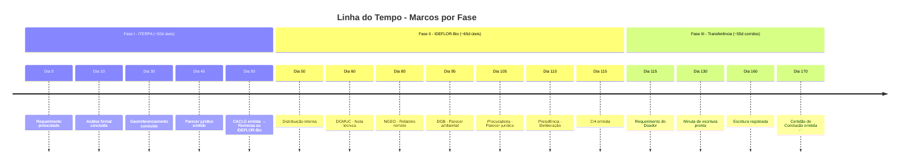

# Quadro de Prazos - IN Conjunta ITERPA / IDEFLOR-Bio

> Referência rápida dos prazos definidos na IN (Cap. IX e disposições esparsas)

## Fase I - ITERPA

| Etapa | Prazo | Tipo | Início | Referência |
|-------|-------|------|--------|------------|
| Análise formal da documentação | **10 dias úteis** | Contínuo | Recebimento do requerimento | Art. 38, I |
| Complementação de documentos (requerente) | **30 dias corridos** | Interrupível | Notificação de pendência | Art. 38, II |
| Análise técnica do georreferenciamento | **20 dias úteis** | Contínuo | Conclusão da análise formal | Art. 38, III |
| Parecer jurídico (Procuradoria ITERPA) | **15 dias úteis** | Contínuo | Conclusão da análise técnica | Art. 38, IV |
| Emissão da CACLG | **5 dias úteis** | Contínuo | Aprovação de todas as análises | Art. 38, V |
| **Total estimado Fase I (sem pendências)** | **~50 dias úteis** | | | |

> Nota: Os prazos podem ser sobrestados quando houver procedimentos de ratificação, retificação ou outras diligências cabíveis (Art. 38, §único).

## Fase II - IDEFLOR-Bio

| Etapa | Prazo | Tipo | Início | Referência |
|-------|-------|------|--------|------------|
| Análise de pertinência (DGMUC) | **10 dias úteis** | Contínuo | Recebimento do processo | Art. 39, I |
| Consulta sobre redirecionamento (requerente) | **10 dias úteis** | Interrupível | Recomendação de redirecionamento | Art. 13, §3º |
| Checagem/monitoramento remoto (NGEO) | **20 dias úteis** (+ 10 prorrogáveis) | Contínuo | Recebimento pela Gerência da UCES | Art. 39, II, Art. 12, §1º |
| Análise compatibilidade ambiental (DGB) | **15 dias úteis** | Contínuo | Conclusão da checagem remota | Art. 39, III |
| Parecer jurídico (Procuradoria) | **10 dias úteis** | Contínuo | Conclusão das análises técnicas | Art. 39, IV |
| Deliberação da Presidência | **5 dias úteis** | Contínuo | Conclusão do parecer jurídico | Art. 39, V |
| Emissão da Certidão de Habilitação | **5 dias úteis** | Contínuo | Deliberação favorável | Art. 39, VI |
| Recurso administrativo (em caso de indeferimento) | **15 dias úteis** | Contínuo | Ciência do interessado | Art. 28 |
| **Total estimado Fase II (sem pendências)** | **~65 dias úteis** | | | |

## Fase III - Transferência do Domínio

| Etapa | Prazo | Tipo | Início | Referência |
|-------|-------|------|--------|------------|
| Elaboração de minuta de escritura (ITERPA) | **15 dias úteis** | Contínuo | Requerimento do Doador | Art. 40, I |
| Lavratura da escritura | **Variável** | - | Agendamento com Cartório | Art. 19, IV |
| Registro da escritura (ITERPA) | **30 dias corridos** | Contínuo | Lavratura da escritura | Art. 40, II |
| Emissão da Certidão de Conclusão (IDEFLOR-Bio) | **10 dias úteis** | Contínuo | Registro da escritura | Art. 40, III |
| **Total estimado Fase III** | **~55 dias corridos** | | | |

## Validades

| Documento | Validade | Prorrogação | Referência |
|-----------|----------|-------------|------------|
| Certidão de Habilitação (CH) | **2 anos** | **Uma vez** por igual período, mediante requerimento fundamentado | Art. 16, VIII |
| Avaliação de benfeitorias | **2 anos** | **Uma vez** por igual período, mediante requerimento fundamentado | Art. 25 |

## Prazos Especiais

| Evento | Prazo | Tipo | Referência |
|--------|-------|------|------------|
| Complementação de documentos (requerente) | 30 dias corridos | Interrupível | Art. 38, II |
| Prorrogação monitoramento remoto (NGEO) | +10 dias úteis | Uma vez | Art. 12, §1º |
| Consulta sobre UCES alternativa | 10 dias úteis | - | Art. 13, §3º |
| Despesas cartorárias | Responsabilidade do Doador | - | Art. 21, §1º |

## Linha do Tempo Estimada (Melhor Cenário)

> **Dica:** No GitHub, use o botão de tela cheia (fullscreen) do diagrama para visualização completa.

```mermaid
gantt
    title Prazos por Fase - Estimativa Melhor Cenário (dias úteis)
    dateFormat  X
    axisFormat  %s dias

    section Fase I - ITERPA
    Análise Formal da Documentação       :f1a, 0, 10
    Análise Técnica do Georreferenciamento :f1b, 10, 30
    Parecer Jurídico (Procuradoria ITERPA) :f1c, 30, 45
    Emissão da CACLG                      :f1d, 45, 50

    section Fase II - IDEFLOR-Bio
    Análise de Pertinência (DGMUC)                     :f2a, 50, 60
    Checagem e Monitoramento Remoto (NGEO)             :f2b, 60, 80
    Análise de Compatibilidade Ambiental (DGB)          :f2c, 80, 95
    Parecer Jurídico (Procuradoria IDEFLOR-Bio)         :f2d, 95, 105
    Deliberação da Presidência                          :f2e, 105, 110
    Emissão da Certidão de Habilitação                 :f2f, 110, 115

    section Fase III - Transferência
    Elaboração da Minuta de Escritura (ITERPA)          :f3a, 115, 130
    Registro da Escritura no Cartório (30d corridos)   :f3b, 130, 160
    Emissão da Certidão de Conclusão (IDEFLOR-Bio)     :f3c, 160, 170
```

> **Total estimado:** ~50 dias úteis (Fase I) + ~65 dias úteis (Fase II) + ~55 dias corridos (Fase III) = **aproximadamente 14-16 semanas** no melhor cenário, sem pendências ou prorrogações.