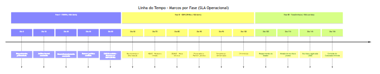

# Quadro de Metas e Prazos (SLA Operacional) - IN Conjunta ITERPA / IDEFLOR-Bio

> **Importante:** A Instrução Normativa Conjunta Oficial **não estabelece prazos máximos para a conclusão dos trâmites internos** (Fases I, II e III). Os prazos mapeados abaixo representam **metas operacionais de SLA sugeridas** para garantir a eficiência no desenvolvimento do software e no fluxo de trabalho das equipes, baseados nas minutas originais do projeto.

## Fase I - ITERPA (SLA Operacional)

| Etapa | Meta de SLA | Tipo | Início | Referência Legal / Status |
|-------|-------------|------|--------|---------------------------|
| Análise formal da documentação | **10 dias úteis** | Contínuo | Recebimento do requerimento | Operacional / Sem prazo na IN |
| Complementação de documentos (requerente) | **30 dias corridos** | Interrupível | Notificação de pendência | Operacional / Saneamento de CAR/Documentos |
| Análise técnica do georreferenciamento | **20 dias úteis** | Contínuo | Conclusão da análise formal | Operacional / Sem prazo na IN |
| Parecer jurídico (Procuradoria ITERPA) | **15 dias úteis** | Contínuo | Conclusão da análise técnica | Operacional / Sem prazo na IN |
| Emissão da CACLG | **5 dias úteis** | Contínuo | Aprovação de todas as análises | Operacional / Sem prazo na IN |
| **Total estimado Fase I (sem pendências)** | **~50 dias úteis** | | | |

> Nota: O fluxo da Fase I pode ser sobrestado a qualquer momento quando houver a necessidade de regularização fundiária, ratificação ou retificação da área (Art. 23 oficial).

## Fase II - IDEFLOR-Bio (SLA Operacional)

| Etapa | Meta de SLA | Tipo | Início | Referência Legal / Status |
|-------|-------------|------|--------|---------------------------|
| Análise de pertinência (DGMUC) | **10 dias úteis** | Contínuo | Recebimento do processo | Operacional / Sem prazo na IN |
| Checagem/monitoramento remoto (NGEO) | **20 dias úteis** | Contínuo | Distribuição ao NGEO | Operacional / Sem prazo na IN |
| Parecer jurídico (Procuradoria) | **10 dias úteis** | Contínuo | Conclusão das análises técnicas | Operacional / Sem prazo na IN |
| Deliberação da Presidência | **5 dias úteis** | Contínuo | Conclusão do parecer jurídico | Operacional / Sem prazo na IN |
| Emissão da Certidão de Habilitação | **5 dias úteis** | Contínuo | Deliberação favorável | Operacional / Sem prazo na IN |
| Recurso administrativo (em caso de indeferimento) | **15 dias úteis** | Contínuo | Ciência do interessado | **Legal - Art. 15, §3º e Art. 28** |
| **Total estimado Fase II (sem pendências)** | **~50 dias úteis** | | | |

## Fase III - Transferência do Domínio (SLA Operacional / Legal)

| Etapa | Meta de SLA / Prazo | Tipo | Início | Referência Legal / Status |
|-------|---------------------|------|--------|---------------------------|
| Minuta de escritura (ITERPA) | **15 dias úteis** | Contínuo | Requerimento do Doador | Operacional / Sem prazo na IN |
| Lavratura da escritura | **Variável** | - | Agendamento com Cartório | Operacional / Art. 19, IV |
| Registro da escritura (ITERPA) | **30 dias corridos** | Contínuo | Lavratura da escritura | **Legal - Art. 21** |
| Emissão da Certidão de Conclusão (IDEFLOR-Bio) | **10 dias úteis** | Contínuo | Registro da escritura | Operacional / Sem prazo na IN |
| **Total estimado Fase III** | **~55 dias corridos** | | | |

## Prazos e Validades Legais (Estabelecidos na IN Oficial)

| Instrumento / Evento | Prazo / Validade | Prorrogação | Referência |
|----------------------|------------------|-------------|------------|
| Certidão de Habilitação (CH) | **2 anos** | **Uma vez** por igual período, sob requerimento fundamentado | Art. 16, VIII |
| Avaliação de benfeitorias | **2 anos** | **Uma vez** por igual período | Art. 25 |
| Registro da escritura no CRI | **30 dias corridos** | Não aplicável | Art. 21 |
| Interposição de Recurso Administrativo | **15 dias úteis** | Não aplicável | Art. 28 |

## Linha do Tempo Estimada (Melhor Cenário Operacional)

### Diagrama de Gantt - SLAs por Fase

### Linha do Tempo - Marcos por Fase

> **Total estimado:** ~50 dias úteis (Fase I) + ~50 dias úteis (Fase II) + ~55 dias corridos (Fase III) = **aproximadamente 12-14 semanas** no melhor cenário operacional de SLAs internos.